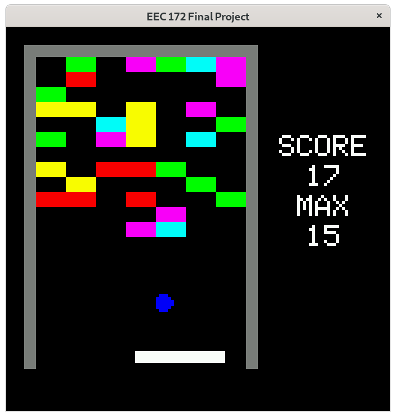
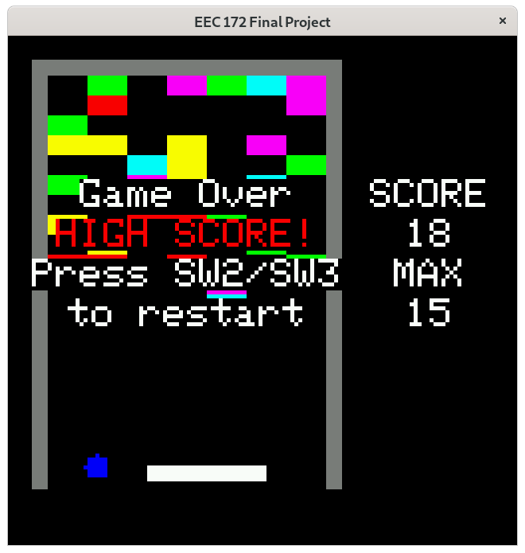
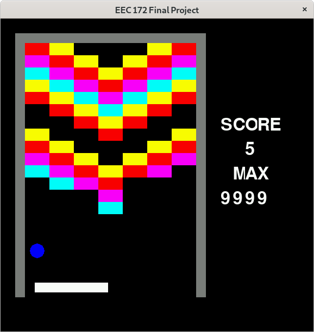

# EEC 172 Final Project
Brick Breaker CC
Eric Li

## Repository Structure
* `report.pdf` is the final report.
	* LaTeX source: `report.tex`.
	* Template: `IEEEtran.cls`.
* `/cc3200/` contains the source code for CC3200.
	* See `report.pdf` for how to set up the wires etc.
* `main.c` contains C version of this project (requires Xlib).
	* `pattern.h` contains data for initializing patterns.
	* Uses `glcdfont.h` from Adafruit library to draw texts.
	* Build the executable with `make main.out` (see `Makefile`).
* `main.py` contains Python version of this project (requires pygame).
* Video demos on Youtube:
	* https://youtu.be/uDkXkYqYVf0: demo on CC3200, used for EEC 100 submission.
		* https://youtu.be/5abHdbAJjIE: raw video.
		* `video.sh`: script to edit the raw video.

## Notes on C and Python Versions
* Move your mouse horizontally to control the velocity of the tray.
* SW2 = `2` on keyboard, SW3 = `3` on keyboard.
	* In C version I hardcoded the key code as `K_2 = 11` etc. If your keyboard
	  layout is different than mine you may have to change this value.
* `Esc` to quit.
* The C version will read and write `/tmp/eec172_max_score.txt` to store scores.
* You can change `ZOOM = 5` to make the window bigger or smaller.

## Gallery
C version, during game

C version, game over

C version demo video

Python version, during game

CC3200 version video

